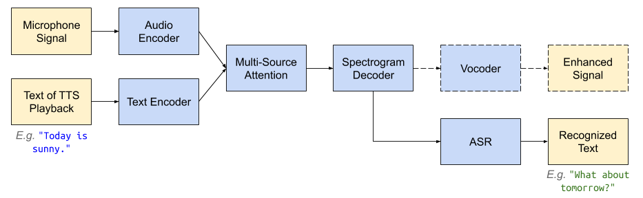
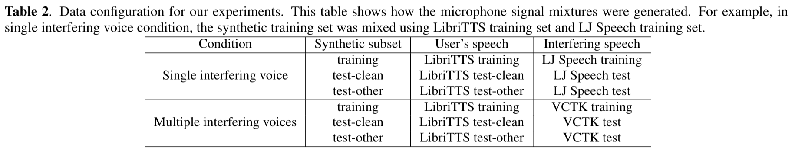
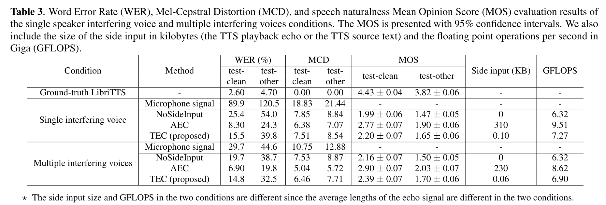

# Textual Echo Cancellation (TEC)

[](https://github.com/wq2012/tec/actions/workflows/pythonapp.yml)
[](https://pypi.org/project/textual-echo-cancellation/)
[](https://pypi.org/project/textual-echo-cancellation/)
[](https://www.pepy.tech/projects/textual-echo-cancellation)

## Introduction

This repository provides a standalone, open-source Python implementation of
**Textual Echo Cancellation (TEC)** based on the IEEE SLT 2021 paper:

> **Textual Echo Cancellation**
> *Shaojin Ding, Ye Jia, Ke Hu, Quan Wang*
> Paper: [https://arxiv.org/pdf/2008.06006](https://arxiv.org/pdf/2008.06006) | Audio Demo Page: [https://google.github.io/speaker-id/publications/TEC/](https://google.github.io/speaker-id/publications/TEC/)

When a user speaks to a smart speaker or voice-enabled device while the device
is playing back a Text-to-Speech (TTS) response, the microphone captures a
reverberant mixture of the user's speech and the device's TTS playback.
Classical Acoustic Echo Cancellation (AEC) requires streaming the full
high-bandwidth TTS reference waveform to the echo canceller. **Textual Echo
Cancellation (TEC)** instead uses the lightweight **text transcript of the
interfering TTS prompt** (< 1 KB) as a side input to a multi-source attention
sequence-to-sequence neural network, canceling the interfering TTS echo and
reconstructing the clean user speech spectrogram and waveform.

<p align="center">
  
</p>

---

## Features

- **Complete Model Suite**:
  - `TecModel`: Multi-source sequence-to-sequence model taking noisy/reverberant
    speech (`SpeechEncoderV1`) and interfering TTS text (`TtsEncoderV2`) with
    `MultiSourceFbeDecoderV1` (`GmmMonotonicAttention` or `AdditiveAttention`).
  - `AecModel` (`AEC-Seq2seq`): Neural baseline taking noisy/reverberant speech
    and clean reference TTS audio with dual speech encoders and multi-source
    attention.
  - `VanillaSeq2SeqModel` (`NoSideInput`): Single-source sequence-to-sequence
    speech enhancement baseline without side input.
  - `NlmsAec` (`AEC-NLMS`): Classical Normalized Least Mean Squares adaptive
    filter baseline.
- **Standalone Lingvo Implementation**: Built on open-source
  [`lingvo`](https://github.com/tensorflow/lingvo) and `tensorflow`, with zero
  dependencies on proprietary internal libraries.
- **End-to-End Pipelines & CLI Scripts**:
  - **Dataset Preparation** (`scripts/prepare_data.py`): Pairs clean speech
    (LibriTTS) with longer interfering TTS utterances (LJSpeech / VCTK),
    simulates room impulse response (RIR) reverberation, mixes at a target SNR
    (default 0 dB), pads trailing zeros, and writes `TFRecord` datasets.
  - **Model Training** (`scripts/train.py`): Trains any registered Lingvo
    configuration (`TecSingleInterfering`, `TecMultiInterfering`,
    `AecSingleInterfering`, `NoSideInputSingleInterfering`, etc.).
  - **Inference & Waveform Synthesis** (`scripts/inference.py`): Predicts
    enhanced log-Mel spectrograms and synthesizes 24 kHz waveforms via
    Griffin-Lim phase reconstruction (`WaveformProcessor`).
  - **Evaluation** (`scripts/evaluate.py`): Computes 13-MFCC Mel Cepstral
    Distortion (MCD) with Dynamic Time Warping (DTW), punctuation-normalized
    Word Error Rate (WER), and model FLOPS / side-input bandwidth.
  - **TFLite Export** (`scripts/export_tflite.py`): Exports trained models to
    `.tflite` FlatBuffer format (with optional dynamic range quantization) and
    validates on-device execution with `tf.lite.Interpreter`.

---

## Installation

Install from PyPI:

```bash
pip3 install textual-echo-cancellation
```

Or install from source:

```bash
git clone https://github.com/wq2012/tec.git
cd tec
pip3 install -r requirements.txt
pip3 install -e .
```

---

## Quickstart

### 1. Prepare Training & Evaluation Datasets

<p align="center">
  
</p>

You can prepare a `TFRecord` dataset from CSV manifests (`utt_id,wav_path,transcript`)
of clean speech (e.g., [LibriTTS](http://www.openslr.org/60/)) and interfering
TTS speech (e.g., [LJSpeech](https://keithito.com/LJ-Speech-Dataset/) or
[VCTK](https://datashare.ed.ac.uk/handle/10283/3443)), or generate a synthetic
dataset for testing:

```bash
# Generate a synthetic TFRecord dataset for quick testing:
python3 scripts/prepare_data.py \
  --generate_synthetic \
  --num_synthetic 16 \
  --snr_db 0.0 \
  --reverb_rt60 0.25 \
  --output_tfrecord /tmp/tec_data/train.tfrecord

# Or prepare from LibriTTS + LJSpeech CSV manifests:
python3 scripts/prepare_data.py \
  --clean_manifest_csv /path/to/libritts_train.csv \
  --interfering_manifest_csv /path/to/ljspeech_train.csv \
  --snr_db 0.0 \
  --reverb_rt60 0.25 \
  --output_tfrecord /tmp/tec_data/train.tfrecord
```

### 2. Train the Model

```bash
python3 scripts/train.py \
  --model TecSingleInterfering \
  --train_file_pattern "/tmp/tec_data/train.tfrecord" \
  --logdir /tmp/tec_checkpoints \
  --max_steps 100 \
  --batch_size 4 \
  --learning_rate 1e-3
```

Available `--model` configurations:
- `TecSingleInterfering`: TEC model (speech + TTS text) for single-speaker TTS
  interference (LibriTTS + LJSpeech).
- `TecMultiInterfering`: TEC model (speech + TTS text) for multi-speaker TTS
  interference (LibriTTS + VCTK).
- `AecSingleInterfering` / `AecMultiInterfering`: `AEC-Seq2seq` baseline
  (speech + TTS reference audio).
- `NoSideInputSingleInterfering` / `NoSideInputMultiInterfering`:
  `Vanilla-Seq2seq` baseline (speech mixture only).

### 3. Run Inference

```bash
python3 scripts/inference.py \
  --model TecSingleInterfering \
  --checkpoint_path /tmp/tec_checkpoints/model.ckpt-100 \
  --mixed_wav /path/to/mixed_input.wav \
  --interfering_text "currently in mountain view it is 72 degrees" \
  --output_wav /tmp/enhanced_clean.wav
```

### 4. Evaluate MCD, WER, and Model Complexity

```bash
python3 scripts/evaluate.py \
  --ref_wav /path/to/clean_reference.wav \
  --pred_wav /tmp/enhanced_clean.wav \
  --ref_transcript "Turn off the bedroom lights!" \
  --hyp_transcript "turn off the bedroom lights" \
  --print_complexity
```

### 5. Export to TensorFlow Lite (`.tflite`)

```bash
python3 scripts/export_tflite.py \
  --model TecSingleInterfering \
  --output_tflite /tmp/tec_model.tflite \
  --num_frames 32 \
  --text_length 16 \
  --decode_steps 8 \
  --quantize \
  --verify
```

---

## Published Paper Results

The following benchmark results are reported in **Table 3** and **Table 4** of
the original paper ([arXiv:2008.06006v4](https://arxiv.org/pdf/2008.06006)) on
24 kHz LibriTTS mixed at 0 dB SNR with reverberant LJSpeech (single interfering
speaker) and VCTK (multiple interfering speakers):

### Speech Enhancement Quality (Paper Table 3)

| Dataset | System | Side Input | WER (%) $\downarrow$ | MCD (dB) $\downarrow$ | MOS $\uparrow$ |
| :--- | :--- | :--- | :---: | :---: | :---: |
| **Single Interfering Speaker** *(LibriTTS + LJSpeech)* | Clean (Upper Bound) | — | 7.6 | — | 4.30 $\pm$ 0.06 |
| | Reverberant + Noisy | None | 75.5 | 13.78 | 1.56 $\pm$ 0.08 |
| | AEC-NLMS | Audio | 76.2 | 15.27 | 1.66 $\pm$ 0.08 |
| | Vanilla-Seq2seq | None | 30.8 | 7.12 | 2.86 $\pm$ 0.14 |
| | AEC-Seq2seq | Audio | 27.6 | 7.04 | 2.94 $\pm$ 0.14 |
| | **TEC (Proposed)** | **Text** | **26.8** | **6.90** | **2.98 $\pm$ 0.13** |
| **Multi Interfering Speakers** *(LibriTTS + VCTK)* | Clean (Upper Bound) | — | 7.6 | — | — |
| | Reverberant + Noisy | None | 74.1 | 12.16 | — |
| | AEC-NLMS | Audio | 73.1 | 15.32 | — |
| | Vanilla-Seq2seq | None | 32.1 | 7.05 | — |
| | AEC-Seq2seq | Audio | 28.0 | 6.80 | — |
| | **TEC (Proposed)** | **Text** | **24.6** | **6.82** | — |

### Computational Complexity & Side-Input Bandwidth (Paper Table 4, 5s Utterance)

| System | Side Input Payload | Total FLOPS |
| :--- | :---: | :---: |
| Vanilla-Seq2seq | 0 KB | $2.1 \times 10^9$ |
| AEC-Seq2seq | ~240 KB (24 kHz 16-bit audio) | $2.5 \times 10^9$ |
| **TEC (Proposed)** | **< 1 KB (TTS text)** | **$2.1 \times 10^9$** |

<p align="center">
  
</p>

---

## Running Unit Tests

To run the full test suite locally:

```bash
bash run_tests.sh
```

---

## Citation

If you find this library useful in your research, please cite the paper:

```bibtex
@inproceedings{ding2021textual,
  title={Textual Echo Cancellation},
  author={Ding, Shaojin and Jia, Ye and Hu, Ke and Wang, Quan},
  booktitle={2021 IEEE Spoken Language Technology Workshop (SLT)},
  pages={653--660},
  year={2021},
  organization={IEEE}
}
```
