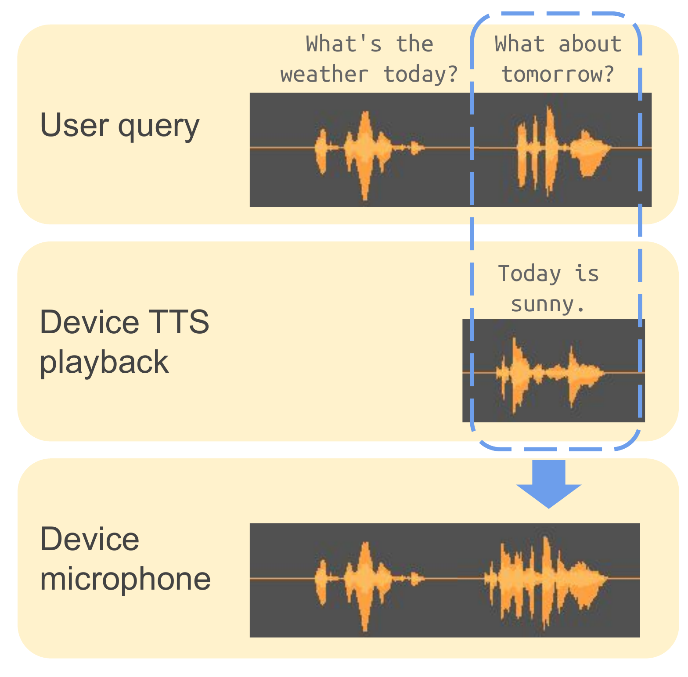
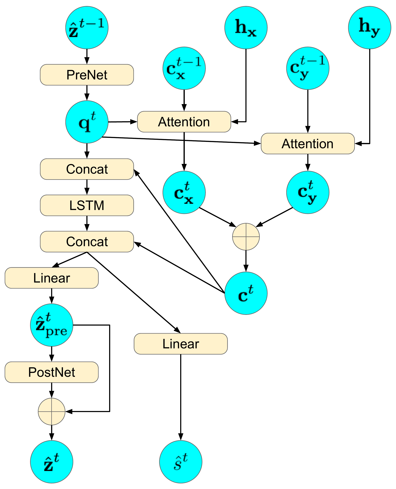

# Textual Echo Cancellation (TEC)

[](https://github.com/wq2012/tec/actions/workflows/pythonapp.yml)
[](https://pypi.org/project/textual-echo-cancellation/)
[](https://pypi.org/project/textual-echo-cancellation/)
[](https://www.pepy.tech/projects/textual-echo-cancellation)

## Introduction

This repository provides a standalone, open-source Python reproduction of
**Textual Echo Cancellation (TEC)** based on the IEEE SLT 2021 paper:

> **Textual Echo Cancellation**
> *Shaojin Ding, Ye Jia, Ke Hu, Quan Wang*
> Paper: [https://arxiv.org/pdf/2008.06006](https://arxiv.org/pdf/2008.06006) | Audio Demo Page: [https://google.github.io/speaker-id/publications/TEC/](https://google.github.io/speaker-id/publications/TEC/)

> [!NOTE]
> **Open-Source Reproduction Notice**: This library is an independent
> open-source reproduction of the published paper above. It does **not** use the
> exact same codebase as the original paper, which was developed on top of
> Google's internal software infrastructure (including internal training
> frameworks, acoustic frontends, room simulators, WaveRNN vocoders, and ASR
> evaluation pipelines). Instead, all modules in this repository are newly
> implemented from scratch using open-source [`lingvo`](https://github.com/tensorflow/lingvo)
> and `tensorflow` to make the architecture, data preparation, training,
> evaluation, and TFLite export accessible to the broader research community.

When a user speaks to a smart speaker or voice-enabled device while the device
is playing back a Text-to-Speech (TTS) response, the microphone captures a
reverberant mixture of the user's speech and the device's TTS playback.
Classical Acoustic Echo Cancellation (AEC) requires streaming the full
high-bandwidth TTS reference waveform to the echo canceller. **Textual Echo
Cancellation (TEC)** instead uses the lightweight **text transcript of the
interfering TTS prompt** (< 1 KB) as a side input to a multi-source attention
sequence-to-sequence neural network, canceling the interfering TTS echo and
reconstructing the clean user speech spectrogram and waveform.

<p align="center">
  
  &nbsp;&nbsp;&nbsp;
  
</p>

---

## Features

- **Complete Model Suite**:
  - `TecModel`: Multi-source sequence-to-sequence model taking noisy/reverberant
    speech (`SpeechEncoderV1`) and interfering TTS text (`TtsEncoderV2`) with
    `MultiSourceFbeDecoderV1` (`GmmMonotonicAttention` or `AdditiveAttention`).
  - `AecModel` (`AEC-Seq2seq`): Neural baseline taking noisy/reverberant speech
    and clean reference TTS audio with dual speech encoders and multi-source
    attention.
  - `VanillaSeq2SeqModel` (`NoSideInput`): Single-source sequence-to-sequence
    speech enhancement baseline without side input.
  - `NlmsAec` (`AEC-NLMS`): Classical Normalized Least Mean Squares adaptive
    filter baseline.
- **Standalone Lingvo Implementation**: Built on open-source
  [`lingvo`](https://github.com/tensorflow/lingvo) and `tensorflow`, with zero
  dependencies on proprietary internal libraries.

<p align="center">
  
</p>
- **End-to-End Pipelines & CLI Scripts**:
  - **Dataset Preparation** (`scripts/prepare_data.py`): Pairs clean speech
    (LibriTTS) with longer interfering TTS utterances (LJSpeech / VCTK),
    simulates room impulse response (RIR) reverberation, mixes at a target SNR
    (default 0 dB), pads trailing zeros, and writes `TFRecord` datasets.
  - **Model Training** (`scripts/train.py`): Trains any registered Lingvo
    configuration (`TecSingleInterfering`, `TecMultiInterfering`,
    `AecSingleInterfering`, `NoSideInputSingleInterfering`, etc.).
  - **Inference & Waveform Synthesis** (`scripts/inference.py`): Predicts
    enhanced log-Mel spectrograms and synthesizes 24 kHz waveforms via
    Griffin-Lim phase reconstruction (`WaveformProcessor`).
  - **Evaluation** (`scripts/evaluate.py`): Computes 13-MFCC Mel Cepstral
    Distortion (MCD) with Dynamic Time Warping (DTW), punctuation-normalized
    Word Error Rate (WER), and model FLOPS / side-input bandwidth.
  - **TFLite Export** (`scripts/export_tflite.py`): Exports trained models to
    `.tflite` FlatBuffer format (with optional dynamic range quantization) and
    validates on-device execution with `tf.lite.Interpreter`.

---

## Installation

Install from PyPI:

```bash
pip3 install textual-echo-cancellation
```

Or install from source:

```bash
git clone https://github.com/wq2012/tec.git
cd tec
pip3 install -r requirements.txt
pip3 install -e .
```

---

## Quickstart

### 1. Prepare Training & Evaluation Datasets

<p align="center">
  
</p>

You can prepare a `TFRecord` dataset from CSV manifests (`utt_id,wav_path,transcript`)
of clean speech (e.g., [LibriTTS](http://www.openslr.org/60/)) and interfering
TTS speech (e.g., [LJSpeech](https://keithito.com/LJ-Speech-Dataset/) or
[VCTK](https://datashare.ed.ac.uk/handle/10283/3443)), or generate a synthetic
dataset for testing:

```bash
# Generate a synthetic TFRecord dataset for quick testing:
python3 scripts/prepare_data.py \
  --generate_synthetic \
  --num_synthetic 16 \
  --snr_db 0.0 \
  --reverb_rt60 0.25 \
  --output_tfrecord /tmp/tec_data/train.tfrecord

# Or prepare from LibriTTS + LJSpeech CSV manifests:
python3 scripts/prepare_data.py \
  --clean_manifest_csv /path/to/libritts_train.csv \
  --interfering_manifest_csv /path/to/ljspeech_train.csv \
  --snr_db 0.0 \
  --reverb_rt60 0.25 \
  --output_tfrecord /tmp/tec_data/train.tfrecord
```

### 2. Train the Model

```bash
python3 scripts/train.py \
  --model TecSingleInterfering \
  --train_file_pattern "/tmp/tec_data/train.tfrecord" \
  --logdir /tmp/tec_checkpoints \
  --max_steps 100 \
  --batch_size 4 \
  --learning_rate 1e-3
```

Available `--model` configurations:
- `TecSingleInterfering`: TEC model (speech + TTS text) for single-speaker TTS
  interference (LibriTTS + LJSpeech).
- `TecMultiInterfering`: TEC model (speech + TTS text) for multi-speaker TTS
  interference (LibriTTS + VCTK).
- `AecSingleInterfering` / `AecMultiInterfering`: `AEC-Seq2seq` baseline
  (speech + TTS reference audio).
- `NoSideInputSingleInterfering` / `NoSideInputMultiInterfering`:
  `Vanilla-Seq2seq` baseline (speech mixture only).

### 3. Run Inference

```bash
python3 scripts/inference.py \
  --model TecSingleInterfering \
  --checkpoint_path /tmp/tec_checkpoints/model.ckpt-100 \
  --mixed_wav /path/to/mixed_input.wav \
  --interfering_text "currently in mountain view it is 72 degrees" \
  --output_wav /tmp/enhanced_clean.wav
```

### 4. Evaluate MCD, WER, and Model Complexity

```bash
python3 scripts/evaluate.py \
  --ref_wav /path/to/clean_reference.wav \
  --pred_wav /tmp/enhanced_clean.wav \
  --ref_transcript "Turn off the bedroom lights!" \
  --hyp_transcript "turn off the bedroom lights" \
  --print_complexity
```

### 5. Export to TensorFlow Lite (`.tflite`)

```bash
python3 scripts/export_tflite.py \
  --model TecSingleInterfering \
  --output_tflite /tmp/tec_model.tflite \
  --num_frames 32 \
  --text_length 16 \
  --decode_steps 8 \
  --quantize \
  --verify
```

---

## Published Paper Reference Results

For reference, **Table 3** of the original paper
([arXiv:2008.06006v4](https://arxiv.org/pdf/2008.06006)) reported the following
results using Google's internal speech infrastructure on 24 kHz LibriTTS mixed
at 0 dB SNR with reverberant LJ Speech (single interfering voice) and VCTK
(multiple interfering voices):

| Condition | Method | WER (%) test-clean ↓ | WER (%) test-other ↓ | MCD (dB) test-clean ↓ | MCD (dB) test-other ↓ | MOS test-clean ↑ | MOS test-other ↑ | Side input (KB) ↓ | GFLOPS ↓ |
| :--- | :--- | :---: | :---: | :---: | :---: | :---: | :---: | :---: | :---: |
| **Ground-truth LibriTTS** | - | 2.30 | 4.50 | 0.00 | 0.00 | 4.43 ± 0.04 | 3.82 ± 0.06 | - | - |
| **Single interfering voice** *(LibriTTS + LJ Speech)* | Microphone signal | 89.9 | 120.5 | 18.83 | 21.44 | - | - | - | - |
| | AEC-NLMS | 48.6 | 60.1 | 12.26 | 12.57 | 1.95 ± 0.10 | 1.28 ± 0.09 | 310 | 0 |
| | Vanilla-Seq2seq | 25.4 | 54.0 | 7.85 | 8.84 | 1.99 ± 0.06 | 1.47 ± 0.05 | 0 | 6.32 |
| | AEC-Seq2seq | 8.30 | 24.3 | 6.38 | 7.07 | 2.77 ± 0.07 | 1.90 ± 0.06 | 310 | 9.51 |
| | **TEC (proposed)** | **15.5** | **39.8** | **7.51** | **8.54** | **2.20 ± 0.07** | **1.65 ± 0.06** | **0.10** | **7.27** |
| **Multiple interfering voices** *(LibriTTS + VCTK)* | Microphone signal | 29.7 | 44.6 | 10.75 | 12.88 | - | - | - | - |
| | AEC-NLMS | 15.5 | 35.5 | 6.57 | 8.13 | 2.06 ± 0.11 | 1.60 ± 0.08 | 230 | 0 |
| | Vanilla-Seq2seq | 19.7 | 38.7 | 7.53 | 8.87 | 2.16 ± 0.07 | 1.50 ± 0.05 | 0 | 6.32 |
| | AEC-Seq2seq | 6.90 | 19.8 | 5.04 | 5.72 | 2.90 ± 0.07 | 2.03 ± 0.07 | 230 | 8.62 |
| | **TEC (proposed)** | **14.8** | **32.5** | **6.46** | **7.71** | **2.39 ± 0.07** | **1.70 ± 0.06** | **0.06** | **6.90** |

> **⋆ Note (Table 3 & Section 3.4–3.5 of the paper)**:
> - The side input size and GFLOPS in the two conditions are different since the average lengths of the echo signal are different in the two conditions (~7 seconds per utterance in LJ Speech vs. ~2 seconds per utterance in VCTK).
> - In the paper, models were trained on 2×2 TPU slices with a global batch size of 32 using the Adam optimizer ($\beta_1=0.9$, $\beta_2=0.999$, $\epsilon=10^{-6}$) and an initial learning rate of $10^{-4}$ exponentially decaying to $10^{-5}$ after 50,000 iterations.

<p align="center">
  
</p>

### Open-Source Reproduction Results

Using the standalone data preparation (`scripts/prepare_data.py`), training
(`scripts/train.py`), and evaluation (`scripts/evaluate.py`) pipelines in this
repository on the open-source **LibriTTS** (`train-clean-100`, `test-clean`,
`test-other`), **LJSpeech-1.1** (90%/10% split), and **VCTK-0.92** (90%/10%
per-speaker split across 109 speakers) datasets at 24 kHz (mixed at 0 dB SNR
with synthetic room impulse responses at RT60 = 0.25 s,
trained for 60 steps on CPU with `batch_size=4, learning_rate=1e-3`, and
evaluated with local `Qwen3-ASR-0.6B-F16` via `audio.cpp` on 20 utterances per
test split):

| Condition | Method | WER (%) test-clean ↓ | WER (%) test-other ↓ | MCD (dB) test-clean ↓ | MCD (dB) test-other ↓ | Side Input test-clean (KB) ↓ | Side Input test-other (KB) ↓ |
| :--- | :--- | :---: | :---: | :---: | :---: | :---: | :---: |
| **Ground-truth LibriTTS** | `GroundTruth` | 3.52 (7/199) | 6.78 (12/177) | 0.00 | 0.00 | 0.000 | 0.000 |
| **Single interfering voice** *(LibriTTS + LJSpeech)* | `MicrophoneSignal` | 90.45 (180/199) | 114.12 (202/177) | 12.86 | 14.61 | 0.000 | 0.000 |
| | `NlmsAec` (AEC-NLMS) | 88.44 (176/199) | 107.34 (190/177) | 12.80 | 14.48 | 243.465 | 209.085 |
| | `NoSideInputSingleInterfering` (Vanilla-Seq2seq) | 45.23 (90/199) | 91.53 (162/177) | 9.58 | 11.34 | 0.000 | 0.000 |
| | `AecSingleInterfering` (AEC-Seq2seq) | 12.06 (24/199) | 23.16 (41/177) | 8.85 | 9.86 | 243.465 | 209.085 |
| | **`TecSingleInterfering` (TEC)** | **21.61 (43/199)** | **46.89 (83/177)** | **8.24** | **9.28** | **0.076** | **0.068** |
| **Ground-truth LibriTTS (Multi split)** | `GroundTruth` | 5.03 (10/199) | 7.82 (19/243) | 0.00 | 0.00 | 0.000 | 0.000 |
| **Multiple interfering voices** *(LibriTTS + VCTK)* | `MicrophoneSignal` | 34.17 (68/199) | 48.97 (119/243) | 7.67 | 7.70 | 0.000 | 0.000 |
| | `NlmsAec` (AEC-NLMS) | 28.64 (57/199) | 34.98 (85/243) | 7.92 | 8.40 | 186.922 | 206.759 |
| | `NoSideInputMultiInterfering` (Vanilla-Seq2seq) | 31.16 (62/199) | 42.39 (103/243) | 7.93 | 8.72 | 0.000 | 0.000 |
| | `AecMultiInterfering` (AEC-Seq2seq) | 8.54 (17/199) | 22.22 (54/243) | 7.80 | 7.88 | 186.922 | 206.759 |
| | **`TecMultiInterfering` (TEC)** | **26.63 (53/199)** | **45.27 (110/243)** | **7.96** | **8.40** | **0.037** | **0.039** |

---

## Running Unit Tests

To run the full test suite locally:

```bash
bash run_tests.sh
```

---

## Citation

If you find this library useful in your research, please cite the paper:

```bibtex
@inproceedings{ding2021textual,
  title={Textual Echo Cancellation},
  author={Ding, Shaojin and Jia, Ye and Hu, Ke and Wang, Quan},
  booktitle={2021 IEEE Spoken Language Technology Workshop (SLT)},
  pages={653--660},
  year={2021},
  organization={IEEE}
}
```
